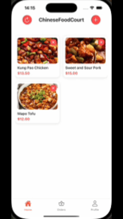
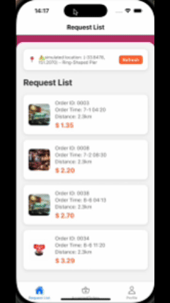
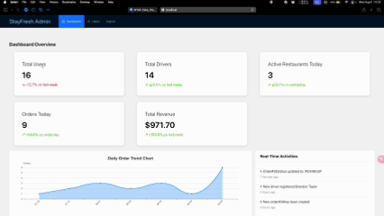
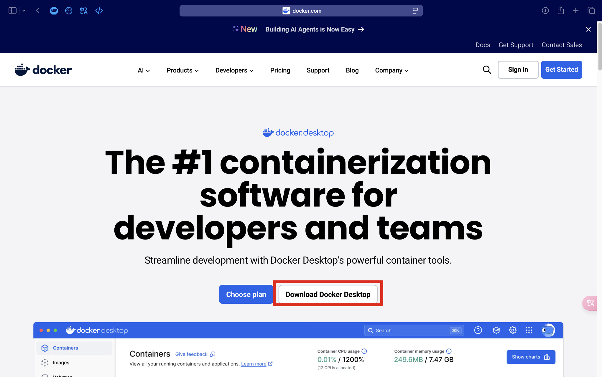
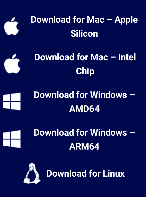
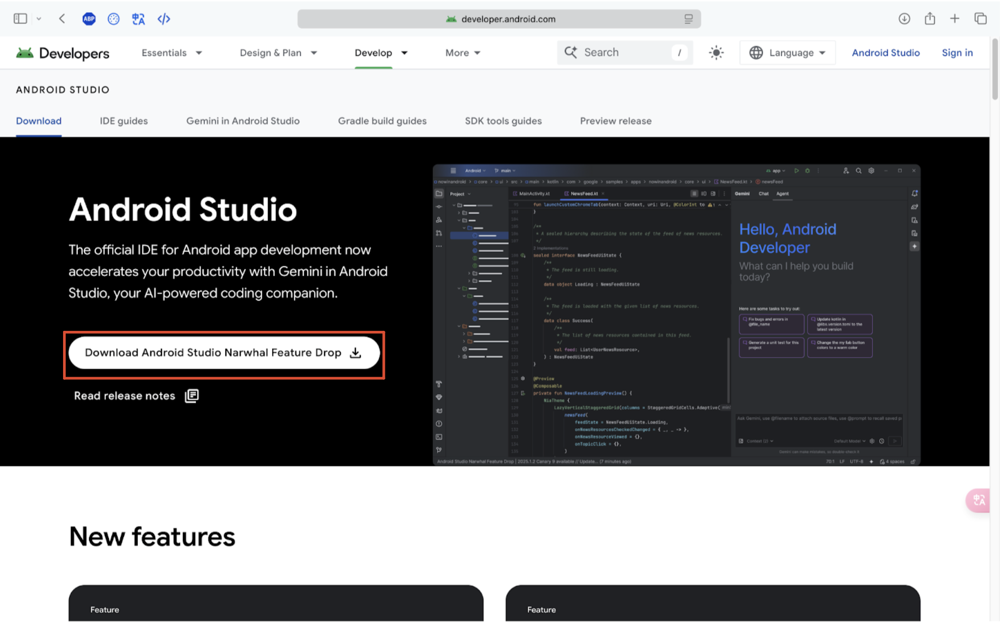
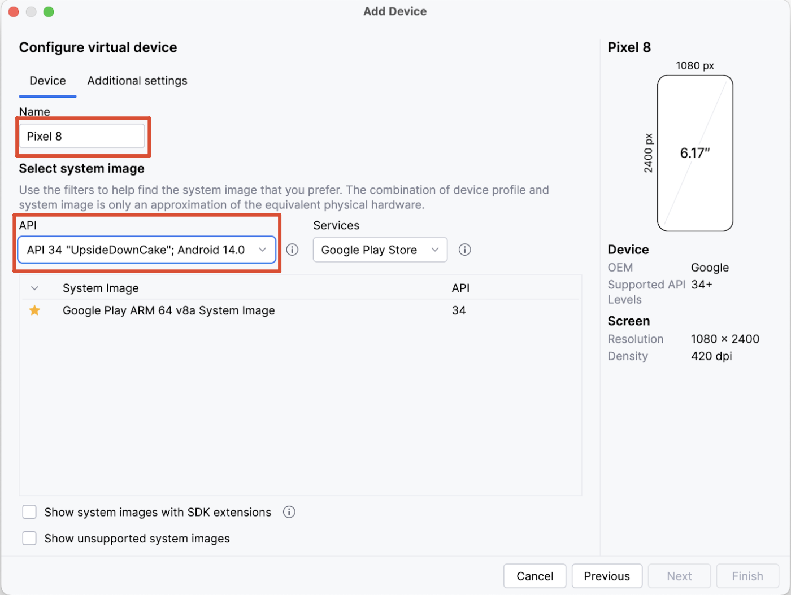

# Food Delivery Mobile Application (Food2U)

> This is a 6-member school offered group project that we can not share the original code. But you can check the other works that we have done below.

## App Demo gifs

> Or you can check here, the [App Pages:Functions Summary](./App%20Pages:Functions%20Summary.pdf) PDF to have overall review of our project.

### Customer APP


### Restaurant APP


### Driver APP


### Admin Website


## [INSTALLATION MANUAL](./INSTALLATION%20MANUAL.pdf)

> To be used for frontend and Apps explore and test.

---

### Quick glance

| Docker Desktop | IOS simulator (Xcode) | Android simulator (Android Studio) | Node.js  | Java21   |
| -------------- | --------------------- | ---------------------------------- | -------- | -------- |
| Required       | Required              | Required                           | Optional | Required |

---

### Software preparation

#### 1) Install Docker Desktop

- Go to [https://www.docker.com/products/docker-desktop/](https://www.docker.com/products/docker-desktop/), then click **Download Docker Desktop** and choose the one that suits your system.
  
  
- After finishing installation, keep it running.

#### 2) iOS Simulator (macOS only)

- Install **Xcode** from the **App Store**.
- Launch the simulator by searching **Simulator** in **Spotlight**.

#### 3) Android Simulator (macOS/Windows)

- Install **Android Studio** from [https://developer.android.com/studio](https://developer.android.com/studio). Click Download and choose the one that suits your system.



- After installation: **Android Studio → New Project → Device Manager → Create AVD** (Pixel 8, API 34).
  

#### 4) Install Java 21 and maven

> Java 21 is required to build the backend JAR locally or run the backend directly on your machine.

**macOS**:

```bash
# install java 21
brew install openjdk@21
echo 'export JAVA_HOME=$(/usr/libexec/java_home -v 21)' >> ~/.zshrc
echo 'export PATH="$JAVA_HOME/bin:$PATH"' >> ~/.zshrc
source ~/.zshrc
java -version
echo $JAVA_HOME

# install maven
brew install maven
```

**Windows**:

```powershell
# install java 21
winget install --id Microsoft.OpenJDK.21 -e
$JAVA_HOME = "C:\Program Files\Microsoft\jdk-21"
[Environment]::SetEnvironmentVariable("JAVA_HOME", $JAVA_HOME, "Machine")
$path = [Environment]::GetEnvironmentVariable("Path","Machine")
[Environment]::SetEnvironmentVariable("Path", $path + ";$JAVA_HOME\bin", "Machine")
java -version
echo $env:JAVA_HOME
```

**Windows Install maven**:
1. Decide install directory - Example: C:\Dev\tools\ or D:\Dev\tools\

2. Download Maven form Official website: https://maven.apache.org/download.cgi
> Download Binary zip archive for Maven 3.9.9: apache-maven-3.9.9-bin.zip

3. Install Maven from ZIP
3.1 Extract the ZIP to your chosen directory, e.g.: C:\Dev\tools\apache-maven-3.9.9

3.2 Set Environment Variables
- Press Win + S, search “Environment Variables” → “Edit the system environment variables”.
- Click Environment Variables…
- Add/Update:
  JAVA_HOME = path to your JDK (e.g. C:\Program Files\Java\jdk-21)
  Optional: MAVEN_HOME = C:\Dev\tools\apache-maven-3.9.9
  Edit Path variable → add:
    C:\Dev\tools\apache-maven-3.9.9\bin
    or:
    %MAVEN_HOME%\bin

3.3 Apply and re-open terminal (environment changes require a new session).

4. Verify Installation
```powershell
mvn -v
where mvn
```
- mvn -v should print Maven, Java, and OS details.
- where mvn should point to your ...\apache-maven-3.9.9\bin\mvn.cmd


---

### Start Project

#### 5) Clone the project from GitHub

```bash
git clone https://github.com/unsw-cse-comp99-3900/capstone-project-25t2-9900-w13a-cake.git
```

- Then go to project’s root folder:

```
cd capstone-project-25t2-9900-w13a-cake
```

- You can run `ls` command to see our project structure:

```
capstone-project-25t2-9900-w13a-cake
├── README.md
├── StayFresh_Backend/
├── foodDelivery_customer/
├── foodDelivery_driver/
├── foodDelivery_restaurant/
└── fooddelivery_admin/
├── docker-compose.yml
├── docker-compose-admin.yml
├── docker-compose-customer.yml
├── docker-compose-driver.yml
├── docker-compose-restaurant.yml
```
- Go to StayFresh_Backend folder, package the backend.
```
cd StayFresh_Backend
mvn install
mvn package
```
- When finishing, go back to the rout folder
```
cd ..
```

#### 6) Run Docker Compose

```bash
docker compose up -d
```

- Wait for all services to start.
  > Check Docker Desktop to confirm services are running.
  > 

#### *) Stop all services:

```bash
docker compose stop
# or
docker compose down
```

---

### Open the Three Mobile Apps (Simulators)

#### 7) iOS (macOS only)

- Go to [https://expo.dev/go](https://expo.dev/go), choose SDK 50, click **iOS Simulator Install**.
  
- Install **Expo Go** app manually on simulator.
  
- Launch Simulator.

Run **Customer App**:

- Open Expo Go, enter: exp://your IP address:8081
- Or use command:

```bash
xcrun simctl openurl booted "exp://<your-ip>:8081"
```

Run **Driver App**:

- Open Expo Go, enter: exp://your IP address:8082
- Or use command:

```bash
xcrun simctl openurl booted "exp://<your-ip>:8082"
```

Run **Restaurant App**:

- Open Expo Go, enter: exp://your IP address:8083
- Or use command:

```bash
xcrun simctl openurl booted "exp://<your-ip>:8083"
```

#### 8) Android (macOS/Windows)

- Android Studio → Device Manager → Start your AVD.
- In **Google Play**, install **Expo Go**.

Run **Customer App**:

- Open Expo Go, enter: exp://your IP address:8081

Run **Driver App**:

- Open Expo Go, enter: exp://your IP address:8082

Run **Restaurant App**:

- Open Expo Go, enter: exp://your IP address:8083
  

> You can open as many simulators that you need, for this project we can open 3 simulators in either IOS or Android.


#### 9) Admin Website

- Visit: [http://localhost:3000](http://localhost:3000)

### Test Accounts

| Role       | Email                | Password |
| ---------- | -------------------- | -------- |
| Customer   | jacksonLai@gmail.com | 123456   |
| Driver     | driver@123.com       | 123456   |
| Restaurant | restaurant@123.com   | 123456   |
| Admin      | admin1@123.com       | 123456   |

**Test Card** (Customer App):

```
4242 4242 4242 4242
Any expiry date / CVV
```

---

### Quick Troubleshooting

**Port already in use**:

- Close the process using the port, then start again.
- macOS:

```bash
kill -9 $(lsof -t -i :<port>)
```

- Windows (PowerShell):

```powershell
Stop-Process -Id (Get-NetTCPConnection -LocalPort <port>).OwningProcess -Force
```

---

### Optional (Run Outside Docker)

#### Node.js 20 LTS

> Node.js 20 LTS is required to run the mobile apps or web admin directly on your machine (without Docker).

**macOS**:

```bash
brew install node@20
echo 'export PATH="/opt/homebrew/opt/node@20/bin:$PATH"' >> ~/.zshrc && source ~/.zshrc
node -v
npm -v
```

**Windows**:

```powershell
winget install --id OpenJS.NodeJS.LTS -e
node -v
npm -v
```

### Development Info

- **MySQL**: root / 123
- **Redis**: root / _(no password)_

### Now you can explore/test the functions of our Apps!

---

---

## StayFresh Backend (Spring Boot)

> A backend service for a multi-role (Customer / Restaurant / Driver / Admin) food delivery platform with ordering, delivery, and multi-payment (Stripe: Card / Apple Pay / Alipay) support.

---

### Table of Contents

- [Overview](#overview)
- [Tech Stack](#tech-stack)
- [Architecture](#architecture)
- [Project Structure](#project-structure)
- [Getting Started](#getting-started)
- [Testing](#-testing)
- [Database & Initialization](#database--initialization)
- [API Documentation](#api-documentation)
- [Authentication & Authorization](#authentication--authorization)
- [Payment (Stripe)](#payment-stripe)
- [Geo Location & Distance Limits](#geo-location--distance-limits)
- [Error Handling & Logging](#error-handling--logging)
- [Configuration](#configuration)
- [Contribution](#contribution)

---

### Overview

- **Roles**: Customer, Restaurant, Driver, Admin.
- **Order Flow**: Browse menu → Place order → Pay → Restaurant accepts/prepares → Driver picks up/delivers → Complete.
- **Payments**: Stripe supports Card, Apple Pay, and Alipay.
- **Geo Features**: Address lat/lng with 10km limit for restaurant listings and deliveries.
- **Ratings**: Rate and review restaurants and drivers.
- **API Docs**: Knife4j.

### Tech Stack

- **Backend**: Java 21, Spring Boot, Spring MVC, Spring Data/MyBatis, Spring Validation
- **Database**: MySQL 9.3.0
- **Cache/Messaging**: Redis
- **Auth**: Firebase Authentication
- **Payments**: Stripe (PaymentIntent + Webhook)
- **Docs**: Knife4j 3.0.3
- **Containers**: Docker, Docker Compose
- **Logging**: Logback

### Architecture

```
[ RN/Frontend ]  ⇄ [ Spring Boot API ]
                                  ├── MySQL (orders, users, restaurants, reviews, payments)
                                  ├── Redis (cache, session, hot data)
                                  ├── Stripe (payments, webhooks)
                                  └── Firebase Auth (token validation)
```

### Project Structure

```
StayFresh_Backend/
├─ mysql/                         # MySQL data volume (excluded from VCS)
├─ redis/                         # Redis data volume (excluded from VCS)
│
├─ SF_Common/                     # Common utilities and shared definitions
│  ├─ src/main/java/com/stayfresh/
│  │  ├─ constant/
│  │  ├─ context/
│  │  ├─ enums/
│  │  ├─ exception/
│  │  ├─ result/
│  │  └─ utils/
│  └─ pom.xml
│
├─ SF_Pojo/                       # Data transfer and entity layer
│  ├─ src/main/java/com/stayfresh/
│  │  ├─ dto/
│  │  ├─ entity/
│  │  └─ vo/
│  └─ pom.xml
│
├─ SF_Service/                    # Main application module
│  ├─ src/main/java/com/stayfresh/
│  │  ├─ config/
│  │  ├─ controller/
│  │  ├─ handler/
│  │  ├─ interceptor/
│  │  ├─ mapper/
│  │  ├─ service/
│  │  └─ StayFreshApplication.java
│  │
│  ├─ src/main/resources/
│  │  ├─ firebase/
│  │  ├─ mapper/
│  │  ├─ static/
│  │  ├─ application.yml
│  │  └─ application-dev.yml
│  │
│  ├─ src/test/java/com/stayfresh/service/
│  │  ├─ AddressServiceTest.java
│  │  ├─ AdminServiceTest.java
│  │  ├─ CustomerServiceTest.java
│  │  ├─ DriverServiceTest.java
│  │  ├─ OrdersServiceTest.java
│  │  ├─ RestaurantServiceTest.java
│  │  └─ ReviewServiceTest.java
│  │
│  ├─ Dockerfile
│  └─ pom.xml
│
├─ pom.xml
└─ .gitignore
```


### Testing

We maintain **comprehensive unit and integration tests** to ensure backend correctness, performance, and reliability.

#### Scope & Coverage

- **Unit Tests**: Validate business logic in service layer (`AddressServiceTest`, `AdminServiceTest`, `CustomerServiceTest`, `DriverServiceTest`, `OrdersServiceTest`, `RestaurantServiceTest`, `ReviewServiceTest`).
  - **Happy paths**: Valid inputs, expected workflows.
  - **Sad paths**: Invalid data, missing resources, unauthorized access.
- **Integration Tests**:
  - MyBatis mappers with real MySQL (Testcontainers).
  - REST API endpoints (`@SpringBootTest` + MockMvc).
  - Redis cache behaviour.
  - Stripe webhook handling (mocked + real test mode).
- **Error Handling**: Global exception mapping, transaction rollbacks, and idempotent payment retries.

#### Tools

- **JUnit 5** — Test framework.
- **Mockito** — Mocking dependencies for isolation.
- **Spring Boot Test** — Context loading and API testing.
- **Testcontainers** — Spin up MySQL/Redis for integration tests.
- **Jacoco** — Code coverage report.

#### How to Run Test

```bash
# Run all tests
mvn test
```


### Coverage Targets
- Line coverage: **≥ 75%**
- Branch coverage: **≥ 60%**
- Critical flows (order placement, payment, delivery) have 100% method coverage.

### Known Limitations
- Stripe API real-mode tests depend on network; in CI we use mocked responses.
- External map/location APIs are mocked in unit tests, manual verification done for E2E.

---

## Database & Initialization

- Tables: `customer`, `restaurant`, `driver`, `admin`, `address`, `dish`, `orders`, `order_detail`, `payment`, `review`.
- Initialization scripts can be placed in `mysql/init/stay_fresh.sql`.

## API Documentation

- Knife4j UI: `http://localhost:8080/doc.html`

## Authentication & Authorization

- Firebase ID Token validation via `FirebaseAuth`.
- Role-based order status transitions enforced.

## Payment (Stripe)

- PaymentIntent creation and confirmation.
- Webhook endpoint for async payment status updates.

## Geo Location & Distance Limits

- Haversine formula for distance calculation.
- 10km delivery radius enforced.

## Error Handling & Logging

- Global exception handler returns structured errors.
- Logback for logging with different profiles.

## Configuration

- `application.yml` and `application-dev.yml` manage environment-specific configs.

## Contribution

- Fork, create a feature branch, and open a PR.
- Follow commit message conventions and keep API docs updated.
