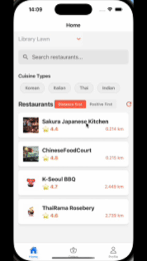
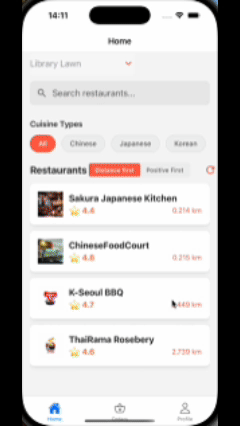

# Food Delivery Mobile Application

> This is a 6-member school offered group project that we can not share the original code. But you can check the other works that we have done below.

### project structure:

```
capstone-project-25t2-9900-w13a-cake
├── README.md
├── StayFresh_Backend/
├── foodDelivery_customer/
├── foodDelivery_driver/
├── foodDelivery_restaurant/
└── fooddelivery_admin/
├── docker-compose.yml
├── docker-compose-admin.yml
├── docker-compose-customer.yml
├── docker-compose-driver.yml
├── docker-compose-restaurant.yml
```

### Overview

- **Roles**: Customer, Restaurant, Driver, Admin.
- **Order Flow**: Browse menu → Place order → Pay → Restaurant accepts/prepares → Driver picks up/delivers → Complete.
- **Payments**: Stripe supports Card, Apple Pay, and Alipay.
- **Geo Features**: Address lat/lng with 10km limit for restaurant listings and deliveries.
- **Ratings**: Rate and review restaurants and drivers.
- **API Docs**: Knife4j.

### Tech Stack

- **Frontend**: React Native, Expo, Javascript, firebase, StripeAPI, GoogleMapsAPI
- **Backend**: Java 21, Spring Boot, Spring MVC, Spring Data/MyBatis, Spring Validation
- **Database**: MySQL 9.3.0
- **Cache/Messaging**: Redis
- **Auth**: Firebase Authentication
- **Payments**: Stripe (PaymentIntent + Webhook)
- **Docs**: Knife4j 3.0.3
- **Containers**: Docker, Docker Compose
- **Logging**: Logback

### Backend Architecture

```
[ RN/Frontend ]  ⇄ [ Spring Boot API ]
                                  ├── MySQL (orders, users, restaurants, reviews, payments)
                                  ├── Redis (cache, session, hot data)
                                  ├── Stripe (payments, webhooks)
                                  └── Firebase Auth (token validation)
```

### Project Structure

```
StayFresh_Backend/
├─ mysql/                         # MySQL data volume (excluded from VCS)
├─ redis/                         # Redis data volume (excluded from VCS)
│
├─ SF_Common/                     # Common utilities and shared definitions
│  ├─ src/main/java/com/stayfresh/
│  │  ├─ constant/
│  │  ├─ context/
│  │  ├─ enums/
│  │  ├─ exception/
│  │  ├─ result/
│  │  └─ utils/
│  └─ pom.xml
│
├─ SF_Pojo/                       # Data transfer and entity layer
│  ├─ src/main/java/com/stayfresh/
│  │  ├─ dto/
│  │  ├─ entity/
│  │  └─ vo/
│  └─ pom.xml
│
├─ SF_Service/                    # Main application module
│  ├─ src/main/java/com/stayfresh/
│  │  ├─ config/
│  │  ├─ controller/
│  │  ├─ handler/
│  │  ├─ interceptor/
│  │  ├─ mapper/
│  │  ├─ service/
│  │  └─ StayFreshApplication.java
│  │
│  ├─ src/main/resources/
│  │  ├─ firebase/
│  │  ├─ mapper/
│  │  ├─ static/
│  │  ├─ application.yml
│  │  └─ application-dev.yml
│  │
│  ├─ src/test/java/com/stayfresh/service/
│  │  ├─ AddressServiceTest.java
│  │  ├─ AdminServiceTest.java
│  │  ├─ CustomerServiceTest.java
│  │  ├─ DriverServiceTest.java
│  │  ├─ OrdersServiceTest.java
│  │  ├─ RestaurantServiceTest.java
│  │  └─ ReviewServiceTest.java
│  │
│  ├─ Dockerfile
│  └─ pom.xml
│
├─ pom.xml
└─ .gitignore
```

---

## App Demo gifs

> Or you can check here, the [App Pages:Functions Summary](./App%20Pages:Functions%20Summary.pdf) PDF to have overall review of our project.

### Customer APP



### Restaurant APP


### Driver APP


### Admin Website


---

## [INSTALLATION MANUAL](./INSTALLATION%20MANUAL.pdf)

> To be used for frontend and Apps explore and test.

---

### Quick glance

| Docker Desktop | IOS simulator (Xcode) | Android simulator (Android Studio) | Node.js  | Java21   |
| -------------- | --------------------- | ---------------------------------- | -------- | -------- |
| Required       | Required              | Required                           | Optional | Required |

---

## StayFresh Backend (Spring Boot)

> A backend service for a multi-role (Customer / Restaurant / Driver / Admin) food delivery platform with ordering, delivery, and multi-payment (Stripe: Card / Apple Pay / Alipay) support.

---

### Testing

We maintain **comprehensive unit and integration tests** to ensure backend correctness, performance, and reliability.

#### Scope & Coverage

- **Unit Tests**: Validate business logic in service layer (`AddressServiceTest`, `AdminServiceTest`, `CustomerServiceTest`, `DriverServiceTest`, `OrdersServiceTest`, `RestaurantServiceTest`, `ReviewServiceTest`).
  - **Happy paths**: Valid inputs, expected workflows.
  - **Sad paths**: Invalid data, missing resources, unauthorized access.
- **Integration Tests**:
  - MyBatis mappers with real MySQL (Testcontainers).
  - REST API endpoints (`@SpringBootTest` + MockMvc).
  - Redis cache behaviour.
  - Stripe webhook handling (mocked + real test mode).
- **Error Handling**: Global exception mapping, transaction rollbacks, and idempotent payment retries.

#### Tools

- **JUnit 5** — Test framework.
- **Mockito** — Mocking dependencies for isolation.
- **Spring Boot Test** — Context loading and API testing.
- **Testcontainers** — Spin up MySQL/Redis for integration tests.
- **Jacoco** — Code coverage report.

#### How to Run Test

```bash
# Run all tests
mvn test
```

### Coverage Targets
- Line coverage: **≥ 75%**
- Branch coverage: **≥ 60%**
- Critical flows (order placement, payment, delivery) have 100% method coverage.

### Known Limitations
- Stripe API real-mode tests depend on network; in CI we use mocked responses.
- External map/location APIs are mocked in unit tests, manual verification done for E2E.

---

## Database & Initialization

- Tables: `customer`, `restaurant`, `driver`, `admin`, `address`, `dish`, `orders`, `order_detail`, `payment`, `review`.
- Initialization scripts can be placed in `mysql/init/stay_fresh.sql`.

## API Documentation

- Knife4j UI: `http://localhost:8080/doc.html`

## Authentication & Authorization

- Firebase ID Token validation via `FirebaseAuth`.
- Role-based order status transitions enforced.

## Payment (Stripe)

- PaymentIntent creation and confirmation.
- Webhook endpoint for async payment status updates.

## Geo Location & Distance Limits

- Haversine formula for distance calculation.
- 10km delivery radius enforced.

## Error Handling & Logging

- Global exception handler returns structured errors.
- Logback for logging with different profiles.

## Configuration

- `application.yml` and `application-dev.yml` manage environment-specific configs.

## Contribution

- Fork, create a feature branch, and open a PR.
- Follow commit message conventions and keep API docs updated.
